# Engineering Blog

A record of real systems I have run and figured out on my own.

Posts come from two cases:

- running something end-to-end that I already understood
- hitting a limitation, learning what was missing, and making it work

The knowledge base holds the full notes and experiments.
This section keeps the practical path from idea to a working setup.

## Where Blog Fits

```mermaid
flowchart LR
    NECTAR[("<b>📚 Nectar</b>")]
    BLOG[("<b>📝 Blog</b>")]
    PROJECTS[("<b>🏛️ Projects</b>")]

    NECTAR -->|"💡 becomes clear & repeatable"| BLOG
    NECTAR -->|"🏗️ components form a platform"| PROJECTS
    BLOG -->|"part of a larger system"| PROJECTS

    style NECTAR   fill:#1565c0,color:#ffffff,stroke:#90caf9,font-weight:bold
    style BLOG     fill:#e65100,color:#ffffff,stroke:#ffcc80,font-weight:bold
    style PROJECTS fill:#9c27b0,color:#ffffff,stroke:#e1bee7,font-weight:bold
```

> 📝 **Blog is the distillation layer.** When something in Nectar becomes clear and repeatable, the practical path gets written here — problem-first, outcome-focused.

## What a Post Looks Like

Every post follows one of two shapes:

- **End-to-end run** — I understood the concept in Nectar, ran it fully, and documented the working path
- **Limitation → fix** — I hit a wall, traced the gap back to first principles in Nectar, and wrote up the resolution

No post exists without a working setup behind it.
